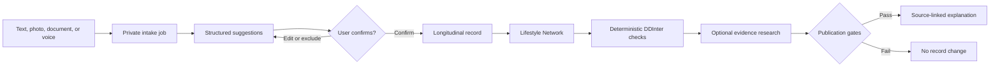

# SignalRx

**Turn scattered health information into one confirmed record—then check what is actually worth reviewing.**

[Open SignalRx](https://jan-hackathon-omega.vercel.app) · [Watch the 60-second demo flow](DEMO_SCRIPT.md)

SignalRx is a UK-focused personal health organiser for adults. It accepts the
messy material people really have—medicine labels, prescriptions, documents,
notes, and speech—structures it into suggestions, and asks the person to confirm
or correct every item before it becomes part of their record.

The narrow problem is deliberate: an interaction checker cannot help if the
medicine list it receives is incomplete, ambiguous, or not what the person
actually takes.

> SignalRx is a hackathon prototype, not a medical device. It organises
> information and prepares questions; it does not diagnose, assign causality,
> change treatment, or guarantee safety.

## Why it is different

Most interaction checkers start with a clean list. SignalRx starts one step
earlier:

1. **Capture what the person has** in the format that is easiest for them.
2. **Show a compact review list** with the original wording beside each
   suggestion.
3. **Require confirmation** before any suggestion changes the record.
4. **Build a longitudinal Lifestyle Network** connecting medicines, conditions,
   symptoms, routines, and care events.
5. **Run deterministic checks first** using imported DDInter knowledge.
6. **Research selected concerns on demand** using source-constrained AI, then
   publish only results that pass schema, citation, source, and treatment-language
   gates.

AI helps with unstructured input and evidence synthesis. It does not get to
silently create confirmed facts or downgrade deterministic findings.

## The product

- Passwordless email OTP and private Supabase sessions
- Text, image, document, recorded-audio, and guided voice intake
- Durable intake jobs with explicit processing and retry states
- Low-friction candidate review: accept, edit, or exclude
- Today view, calendar, searchable library, and record settings
- Interactive Lifestyle Network with accessible list parity
- Automatic record relationships and deterministic DDInter screening
- Optional evidence investigation restricted to authoritative clinical domains
- Collapsed, deduplicated source disclosure and plain-language progress states
- Account export, deletion controls, and user-led Yellow Card drafting

The interface uses a warm paper-and-ink visual system rather than a generic
clinical dashboard. Uncertainty uses restrained amber; teal signals confirmed or
safe-to-proceed interface states, never clinical safety.

## One-minute judge route

Prepare a signed-in account with **synthetic data only**, then:

| Time | Show | Point |
| --- | --- | --- |
| 0:00–0:08 | Landing page | Health information is fragmented before it ever reaches an interaction checker. |
| 0:08–0:20 | Add → review list | AI proposes structured facts; the person stays in control. |
| 0:20–0:32 | Today | Confirmed information becomes a useful daily record. |
| 0:32–0:45 | Lifestyle Network | The record becomes a connected, inspectable graph rather than a flat medicine list. |
| 0:45–0:56 | Evidence investigation | Deterministic findings stay authoritative; AI researches the explanation and cites sources. |
| 0:56–1:00 | Sources dropdown | Evidence is available without overwhelming the main experience. |

The complete spoken script is in [DEMO_SCRIPT.md](DEMO_SCRIPT.md).

## Architecture



### Safety and evidence boundaries

- Intake output is validated with strict Zod schemas.
- Candidate suggestions cannot mutate the record before confirmation.
- The evidence investigator receives a privacy-minimised graph, not direct
  identifiers or source files.
- Research is restricted to an allowlist including NHS, NICE, GOV.UK, eMC,
  regulators, WHO, and peer-reviewed indexes.
- Every published clinical statement must reference a source present in the
  provider search trace.
- Agent-discovered items remain labelled as research leads.
- DDInter triggers and severity cannot be removed, downgraded, or relabelled by
  the model.
- Patient-facing output is rejected if it tells someone to start, stop, skip,
  replace, or change the dose of a medicine.

## Technical implementation

| Layer | Implementation |
| --- | --- |
| Web application | Next.js 16, React 19, TypeScript |
| UI | Custom responsive design system, GSAP, vis-network |
| Auth and data | Supabase Auth, Postgres, row-level security, private Storage |
| Intake worker | Supabase Edge Function with durable job state |
| AI extraction | GPT-5.6 with strict application-side validation |
| Evidence research | OpenAI Agents SDK, GPT-5.6 Terra at medium reasoning, web search |
| Interaction knowledge | Versioned DDInter CSV import plus curated deterministic rules |
| Hosting | Vercel |
| Verification | Vitest, Testing Library, Playwright, ESLint, TypeScript |

The codebase separates deterministic knowledge, normalisation, graph preparation,
AI investigation, evidence policy, persistence, and streaming. The current
unit and integration suite contains **55 tests**, including privacy boundaries,
owner RLS, schema security, deterministic matching, and evidence policy.
Playwright coverage additionally checks protected routes, mobile overflow, and
keyboard access.

### Tools used where they genuinely help

- **OpenAI:** structured candidate extraction and source-constrained evidence
  research—the two places where unstructured language is the actual bottleneck.
  It is deliberately excluded from confirmation authority and deterministic
  interaction severity.
- **Supabase:** passwordless identity, row-level ownership, private source
  storage, durable intake state, Postgres relationships, and the intake worker.
- **Vercel:** production hosting and server-side delivery of the Next.js
  application at the public judge URL.
- **vis-network:** an interactive, keyboard-focusable view of the confirmed
  record, paired with a plain list so the graph is never the only interface.

## Honest validation status

This is a working hackathon prototype with synthetic demo data. **We have not
conducted external user testing and do not claim real users.** The repository
therefore makes no user-count, retention, clinical-outcome, or adoption claims.

Before accepting real public health data, the project would need clinical safety
ownership, a DPIA and lawful-basis review, a privacy and retention policy,
subprocessor review, incident response, a clinical hazard log, and the relevant
UK medical-software assessment.

## Run locally

Requirements: Node.js 20.9+, pnpm 11, and the Supabase CLI.

```powershell
pnpm install
Copy-Item .env.example .env.local
pnpm dev
```

Open [http://localhost:3000](http://localhost:3000).

There is no anonymous or fictional fallback. A connected Supabase project is
required for registration and personal records.

### Environment

Copy `.env.example` and configure:

- `NEXT_PUBLIC_SUPABASE_URL`
- `NEXT_PUBLIC_SUPABASE_PUBLISHABLE_KEY`
- `SUPABASE_SECRET_KEY`
- `OPENAI_API_KEY`
- `OPENAI_REALTIME_MODEL=gpt-realtime-2.1`
- `OPENAI_HARMONIZATION_MODEL=gpt-5.6`
- `OPENAI_INTERACTION_MODEL=gpt-5.6-terra`
- `OPENAI_ONBOARDING_MODEL=gpt-5.6-luna`

Never expose an OpenAI or Supabase secret through a `NEXT_PUBLIC_` variable.

### Database and worker

```powershell
pnpm dlx supabase db push
pnpm dlx supabase functions deploy process-intakes
```

Set the worker’s OpenAI secret in Supabase. To load a licensed or downloaded
DDInter snapshot:

```powershell
$env:DDINTER_VERSION = "2.0"
pnpm import:ddinter C:\path\to\ddinter_A.csv C:\path\to\ddinter_B.csv
```

## Verify

```powershell
pnpm lint
pnpm typecheck
pnpm test
pnpm build
pnpm test:e2e
```

The live application is deployed at
**[https://jan-hackathon-omega.vercel.app](https://jan-hackathon-omega.vercel.app)**.
